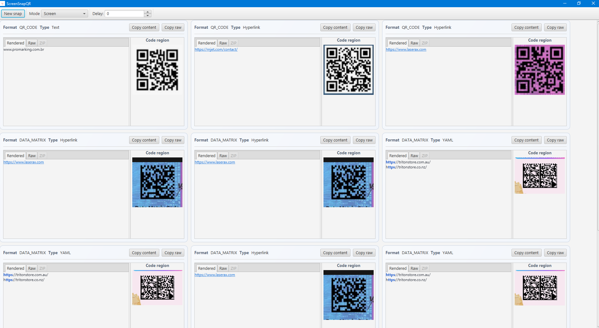

# screen-snap-qr
`screen-snap-qr` is a JavaFX desktop app that captures your screen, detects QR/Barcode/Data Matrix payloads, and presents their content in a readable, type-aware UI.

## Screenshot



## Features

- Capture and scan visible codes from the screen.
- Capture modes: full **Screen**, **Selection** snip (with highlighted drag area), and focused **Window**.
- Decode multiple formats via ZXing (including QR Code and Data Matrix).
- Classify scanned payloads as:
  - Text
  - Hyperlink
  - JSON
  - XML
  - YAML
  - ZIP archive
- Render decoded content with richer visualization:
  - tokenized/highlighted view for structured text (JSON/XML/YAML)
  - dedicated ZIP tab with recursive archive tree
- Copy decoded content and raw payload bytes.

## Tech Stack

- **Java 21**
- **JavaFX** for desktop UI
- **ZXing** for barcode decoding
- **Jackson** for JSON handling
- **JUnit 5 + TestFX + Mockito** for tests

## Requirements

- **Java 21+**
- **Maven 3.x**

On Windows, point Maven to JDK 21 before building:

```powershell
$env:JAVA_HOME="C:\Program Files\Java\jdk-21"
$env:PATH="$env:JAVA_HOME\bin;$env:PATH"
```

## Build and Run

1. Clone the repository:
   ```bash
   git clone https://github.com/talaatharb/screen-snap-qr.git
   ```
2. Go to the Maven module:
   ```bash
   cd screen-snap-qr/screen-snap-qr
   ```
3. Build:
   ```bash
   mvn clean package
   ```
4. Run:
   ```bash
   mvn javafx:run
   ```

## Usage

1. Launch the app.
2. Set optional delay and click **New snap**.
3. Keep your target QR/barcode visible on screen.
4. Review each detected result card:
   - **Format** badge for code format
   - **Type** badge for payload classification
   - **Rendered** tab for readable content
   - **Raw** tab for Base64 payload bytes
   - **ZIP** tab (when applicable) for archive tree

## Contributing

Contributions are welcome through issues and pull requests.
