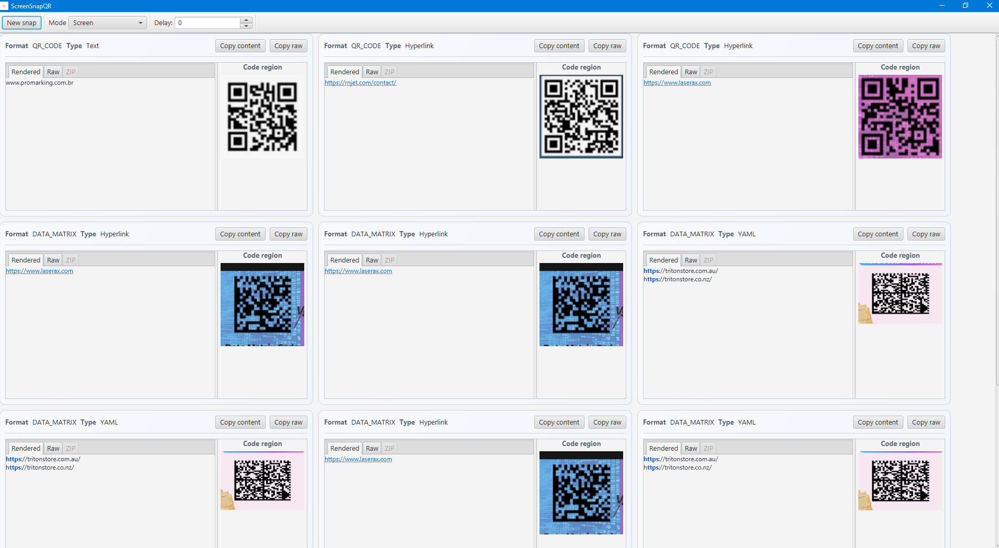

# screen-snap-qr
`screen-snap-qr` is a JavaFX desktop app that captures your screen, detects QR/Barcode/Data Matrix payloads, and presents their content in a readable, type-aware UI.

## Screenshot



## Features

- Capture and scan visible codes from the screen.
- Capture modes: full **Screen**, **Selection** snip (with highlighted drag area), and focused **Window**.
- Decode multiple formats via ZXing (including QR Code and Data Matrix).
- Classify scanned payloads as:
  - Text
  - Hyperlink
  - JSON
  - XML
  - YAML
  - ZIP archive
- Render decoded content with richer visualization:
  - tokenized/highlighted view for structured text (JSON/XML/YAML)
  - dedicated ZIP tab with recursive archive tree
- Copy decoded content and raw payload bytes.
- Deduplicate repeated Data Matrix detections by content and approximate on-screen
  location (tolerant of small coordinate differences across preprocessing passes),
  instead of requiring an exact pixel match, while still keeping genuinely distinct
  on-screen occurrences of the same code separate.
- View the textual contents of any file inside a scanned ZIP archive in a standalone,
  resizable **document viewer** (built on [RichTextFX](https://github.com/FXMisc/RichTextFX)),
  opened via right-click ("View content") on a file node in the ZIP tree.
  - Syntax highlighting for **XML** and **JSON** content.
- Detect Romanian e-prescription Data Matrix payloads (`PEBarcode.xsd` schema, root
  `<P>`/`<O>` elements) — either directly as the scanned XML payload (right-click on
  the **Rendered** tab) or nested inside a ZIP entry (right-click on the ZIP tree) —
  and offer a **"View prescription"** option that opens a dedicated, resizable
  **prescription viewer** presenting the decoded prescriber, patient, pharmacy, and
  medication data with human-readable labels.
  - Responsive layout that reflows to the viewer window size.
  - Copyable field values (individually, via selection, or all at once via
    **Copy all details**).
  - **Export...** to a plain-text report or JSON file for easy sharing.
- Detect EU e-invoicing Data Matrix/QR payloads (UBL 2.1 `Invoice`/`CreditNote` XML,
  as profiled by Peppol BIS Billing 3.0) — either directly as the scanned XML payload
  (right-click on the **Rendered** tab) or nested inside a ZIP entry (right-click on
  the ZIP tree) — and offer a **"View e-invoice"** option that opens a dedicated,
  resizable **invoice viewer** presenting the seller/buyer parties, payment means,
  VAT breakdown, monetary totals, and invoice/credit-note lines with EN 16931
  business-term (`BT-*`) human-readable labels.
  - Responsive layout that reflows to the viewer window size.
  - Copyable field values (individually, via selection, or all at once via
    **Copy all details**).
  - **Export...** to a plain-text report or JSON file for easy sharing.

## Tech Stack

- **Java 21**
- **JavaFX** for desktop UI
- **ZXing** for barcode decoding
- **Jackson** for JSON handling
- **RichTextFX** for the syntax-highlighted document and prescription viewers
- **JUnit 5 + TestFX + Mockito** for tests

## Requirements

- **Java 21+**
- **Maven 3.x**

On Windows, point Maven to JDK 21 before building:

```powershell
$env:JAVA_HOME="C:\Program Files\Java\jdk-21"
$env:PATH="$env:JAVA_HOME\bin;$env:PATH"
```

## Build and Run

1. Clone the repository:
   ```bash
   git clone https://github.com/talaatharb/screen-snap-qr.git
   ```
2. Go to the Maven module:
   ```bash
   cd screen-snap-qr/screen-snap-qr
   ```
3. Build:
   ```bash
   mvn clean package
   ```
4. Run:
   ```bash
   mvn javafx:run
   ```

## Usage

1. Launch the app.
2. Set optional delay and click **New snap**.
3. Keep your target QR/barcode visible on screen.
4. Review each detected result card:
   - **Format** badge for code format
   - **Type** badge for payload classification
   - **Rendered** tab for readable content
   - **Raw** tab for Base64 payload bytes
   - **ZIP** tab (when applicable) for archive tree

## Roadmap: Structured Schema Viewers

Many real-world QR / Data Matrix codes carry payloads that follow a well-known,
publicly documented XML or JSON schema (in addition to the Romanian e-prescription
and EU e-invoicing schemas already supported). The plan is to add a dedicated,
dictionary-driven detector + viewer for each of these, following the same pattern
established by the e-prescription and e-invoicing viewers (schema detection →
typed parser/model → human-readable, responsive, copyable/exportable viewer
surfaced via the ZIP tree's right-click menu and/or directly on scanned results).

Planned implementation order:

1. ~~**EU e-invoicing (Peppol BIS Billing 3.0 / UBL 2.1 XML)**~~ — **Done.** Detects
   and visualizes UBL `Invoice`/`CreditNote` XML documents (seller/buyer parties,
   tax breakdown, line items, payment terms), the standard used across the EU for
   structured e-invoicing (including invoices referenced or embedded via QR code).
2. **SMART Health Cards (SHC)** — decode the compressed, JWS-signed FHIR JSON
   payload used for vaccination/lab-result health cards (`shc:/...` QR payloads),
   verify/parse the JWS structure, and render the underlying FHIR
   `Immunization`/`Observation`/`Patient` resources in a readable form.
3. **US DSCSA (GS1 DataMatrix Application Identifiers)** — parse GS1 AI-encoded
   Data Matrix payloads used for US Drug Supply Chain Security Act pharmaceutical
   serialization (GTIN, batch/lot, expiry, serial number) and present them with
   resolved AI labels, mirroring the EU FMD packaging use case.

Further candidates to consider afterwards, roughly in order of expected value:

- **EU Digital COVID Certificate (HCERT)** — CBOR/JSON-schema-defined
  vaccination/test/recovery certificate payload.
- **India GSTN e-Invoice QR** — JSON payload with seller GSTIN, IRN, invoice value,
  tax breakdown, and signed hash.
- **Aadhaar Secure QR (India)** — signed XML payload with demographic data.
- **DIVOC / W3C Verifiable Credentials** — JSON-LD vaccination/health certificates.

## Contributing

Contributions are welcome through issues and pull requests.
